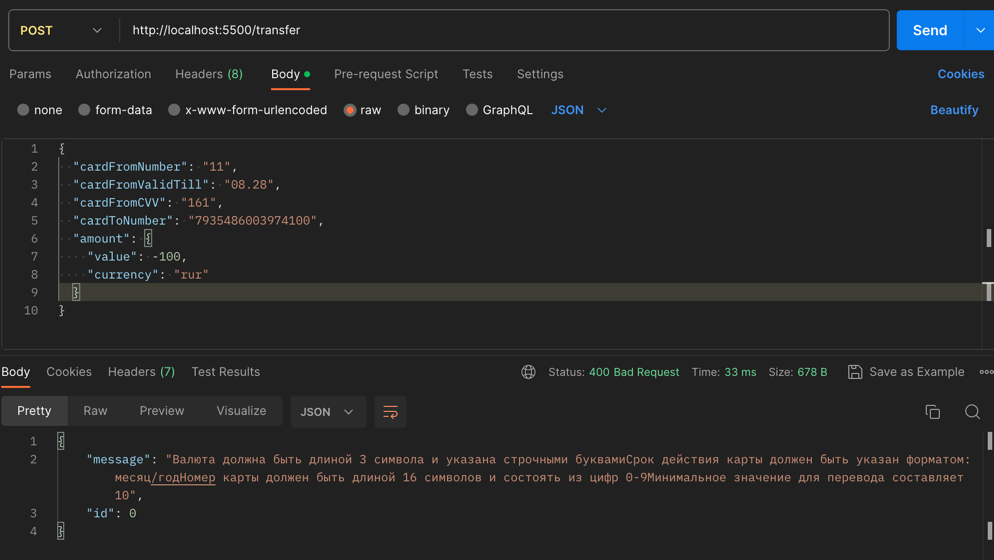

# Сервис для перевода с карты на карту
## Описание задания: [Задание](https://github.com/netology-code/jd-homeworks/blob/master/diploma/moneytransferservice.md)
## Описание решения
RESTful приложение для перевода денег с карты на карту. Работает на порту 5500 по протоколу HTTP совместно с фронт частью приложения, расположенной по 
адресу: [FRONT](https://serp-ya.github.io/card-transfer/). Однако, в соответствие в принципами построения REST является независимым от нее. 
Данные о картах, транзакциях и подтверждениях хранятся в файловой системе в потокобезопасных коллекциях. Данные о проведенных транзакциях дополнительно записываются в файл по адресу 
/transfer-logs.log
    Документация по API: http://localhost:5500/swagger-ui/index.html
## Запуск
Перейти в корень, собрать проект:
```
mvn clean package --Dskiptests
```
В корневой папке выполнить команду:
```
docker compose up
```
## Перед началом работы
Для тестирования задания было создано дополнительное API для взаимодействия с картами. Так, при запуске контейнера создаются новые карты с балансом 
1000 у.е., данные которых можно узнать в логах. К примеру: 
```
2023-08-13 14:48:20 2023-08-13 11:48:20,087  INFO  [        main] c.m.a.c.service.impl.CardServiceImpl     : Card: number=7427010245550803, validTill=08/28, cvv=173, value=1000, currency=RUR 
2023-08-13 14:48:20 2023-08-13 11:48:20,087  INFO  [        main] c.m.a.c.service.impl.CardServiceImpl     : Card: number=2558173289728577, validTill=08/28, cvv=976, value=1000, currency=RUR 
```
## Примеры запросов
1) Транзакция с подтверждением кодом. Смотрим в логах доступные карты:
```
2023-08-14 09:28:22 2023-08-14 06:28:22,511  INFO  [        main] c.m.a.c.service.impl.CardServiceImpl     : Card: number=4564378018537402, validTill=08/28, cvv=161, value=1000, currency=RUR 
2023-08-14 09:28:22 2023-08-14 06:28:22,511  INFO  [        main] c.m.a.c.service.impl.CardServiceImpl     : Card: number=7935486003974100, validTill=08/28, cvv=511, value=1000, currency=RUR 
```
Выполняем перевод


   Смотрим результаты транзакции в /transfer-logs.log

4) Карта не найдена. Ввод несуществующей карты:
1[](test-transfer-error-card_not_found.png)

5) Недостаточно средств для перевода


## Примеры запросов без фронта
1) Ошибки заполнения полей DTO.

2) Подтверждение несуществующей операции.

3) Неверный код подтверждения

